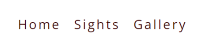
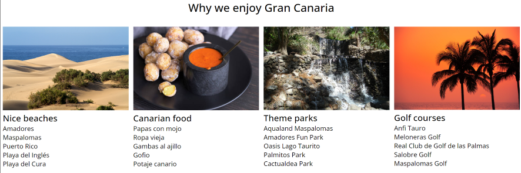
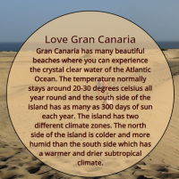
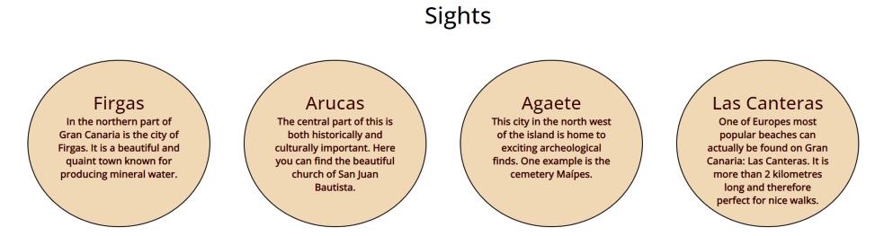
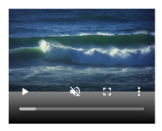
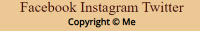
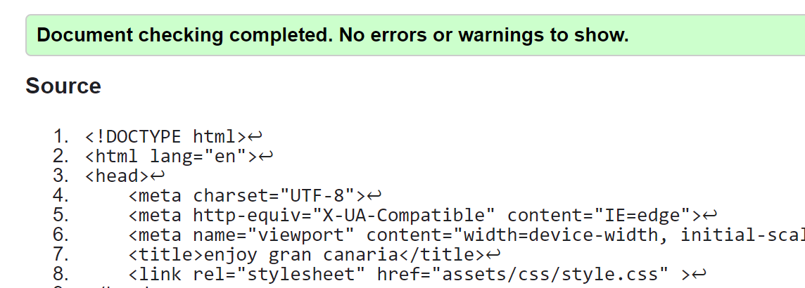
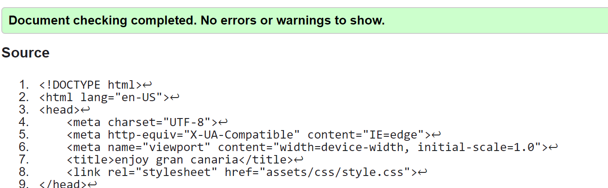
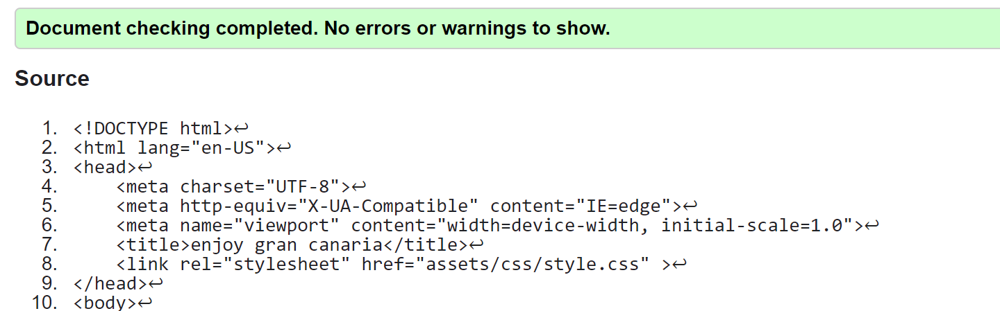
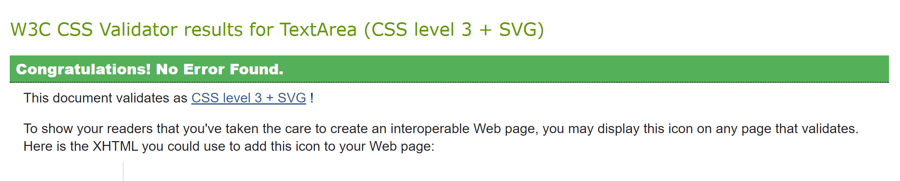

# Enjoy Gran Canaria!

Enjoy Gran Canaria is a site which offers information about the wonderful island of Gran Canaria. The site is a help to anyone who might visit the island on what to do or where to go. 

**Existing features:**

* Navigation bar: 

- On all three pages in the top right corner is the navigation bar. The navigation bar includes links to the Home page, Sights page and the Gallery.
- This feature allows users to at any time move between pages.

* Why we love Gran Canaria lists:

- This section provides users with information on why to visit the island, where to go and what to do.

* Information bubble:

- The information bubble on the sights page provides users with interesting and useful information about Gran Canaria. 
- The user will quickly get a feel for everything that Gran Canaria has to offer.

* Sights:

- The four informational bubbles provides users with tips on where to go in order to experience the real Gran Canaria.

* Ocean waves:

- This video allows the user to straight away get a feel of what visiting the island can be like listening to crashing waves.

Gallery:

This page visualizes what Gran Canaria is all about through beautiful images from the island.

* Footer:

- The footer includes social media links allowing the users to find more information on Gran Canaria on their own.

Testing:

- Validator testing:

* HTML: No errors were returned when passing through the official W3C validator

* CSS: No errors were found when passing through the official Jigsaw validator

Deployment:

- The site was deployed to GitHub pages. The live link can be found here - 

Credits:

* Content:
- The information on all pages was found on https://apollo.se and https://canariainfo.com/en/general-info 

* Media:
- The images as well as the video used on the entire website are from Pixabay
